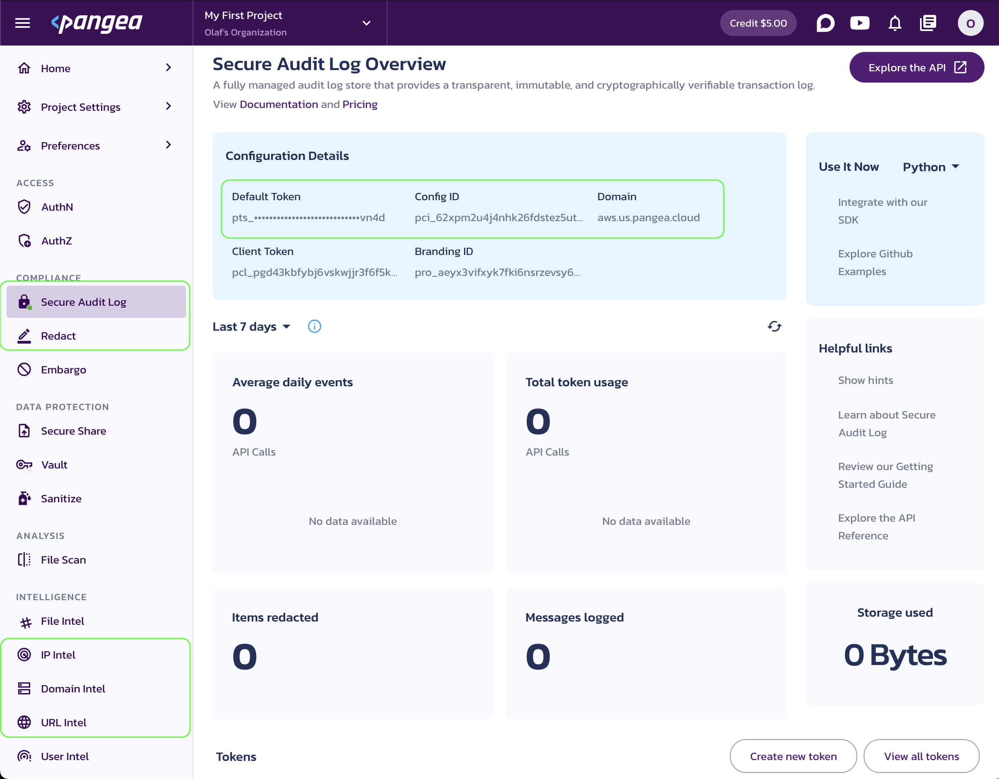
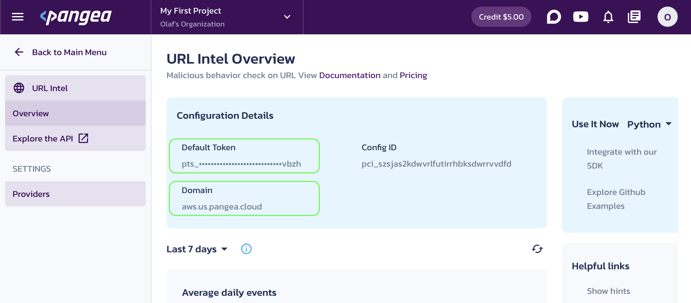
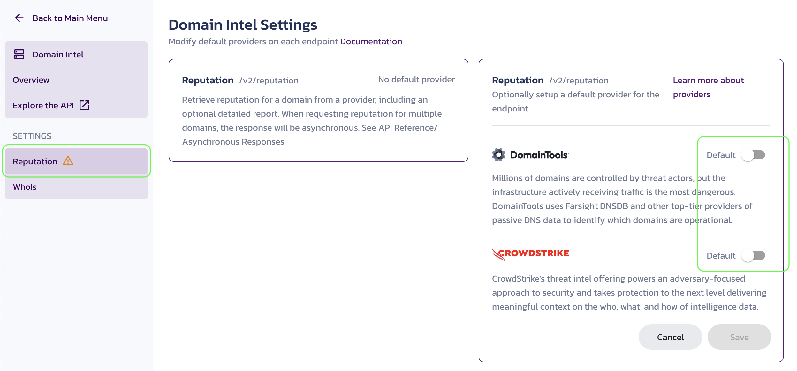

# LLM Prompt & Response Guardrails in Python with LangChain and Pangea

This tutorial demonstrates how to quickly add Pangea Services to any LangChain application to address concerns outlined in [OWASP LLM06: Sensitive Information Disclosure](https://genai.owasp.org/llmrisk/llm06-sensitive-information-disclosure/), help prevent [OWASP LLM02: Insecure Output Handling](https://genai.owasp.org/llmrisk/llm02-insecure-output-handling/), mitigate vulnerabilities described in [OWASP LLM01: Prompt Injection](https://genai.owasp.org/llmrisk/llm01-prompt-injection/), and reduce the effects of [OWASP LLM03: Training Data Poisoning](https://genai.owasp.org/llmrisk/llm03-training-data-poisoning/).

LangChain and Pangea offer flexible, composable APIs for building, securing, and launching generative AI applications. This tutorial focuses on securing input prompts submitted to an LLM and the responses from the LLM during user interactions with the application, helping you achieve the following objectives:

- Enhance data privacy and prevent leakage and exposure of sensitive information (OWASP LLM06, OWASP LLM01), such as:
  - Personally Identifiable Information (PII)
  - Protected Health Information (PHI)
  - Financial data
  - Secrets
  - Intellectual property
  - Profanity
- Remove malicious content from input and output (OWASP LLM03, OWASP LLM01)
- Monitor user inputs and model responses and enable comprehensive threat analysis, auditing, and compliance (OWASP LLM01)

## Prerequisites

Skip any prerequisites you’ve already completed.

### Python

- Python v3.10 or greater
- pip v23.0.1 or greater

### OpenAI API key

This tutorial uses an OpenAI model. Get your [OpenAI API key](https://platform.openai.com/api-keys) to run the examples.

### Free Pangea account and your first project

To build a secure chain, you’ll need a free [Pangea account](https://pangea.cloud/signup) to host the security services used in this tutorial:

- [Secure Audit Log](https://pangea.cloud/services/secure-audit-log/)
- [Redact](https://pangea.cloud/services/redact/)
- [Domain Intel](https://pangea.cloud/services/domain-intel/reputation/)
- [IP Intel](https://pangea.cloud/services/ip-intel/reputation/)
- [URL Intel](https://pangea.cloud/services/url-intel/)

After creating your account, click **Skip** on the **Get started with a common service** screen. This will take you to the Pangea User Console, where you can enable all required services.

### Pangea services used in this tutorial

To enable each service, click its name in the left-hand sidebar and follow the prompts, accepting all defaults. When you’re finished, click **Done** and **Finish**. Enabled services will be marked with a green dot.

<figure>
  
  <figcaption>Pangea Services</figcaption>
</figure>

When a service is enabled, capture its **Configuration Details**:

- **Domain** (shared across all services in the project)
- **Default Token** (a token provided by default for each service)

For Secure Audit Log and Redact, also capture the **Config ID** value. These services support multiple configurations, so it’s a good practice to specify the configuration ID explicitly:

- **Config ID**

You can copy these values by clicking the respective property tiles.

<figure>
  
  <figcaption>Pangea Service Configuration Details</figcaption>
</figure>

For the **Domain Intel** and **IP Intel** services, click **Reputation** in the left-hand sidebar, then select a default provider.

<figure>
  
  <figcaption>Select a default provider</figcaption>
</figure>

After enabling each service, click **Back to Main Menu** in the top left.

> For more details about each service and to learn about advanced configuration options, > visit the respective service documentation:
>
> - [Secure Audit Log](https://pangea.cloud/docs/audit/getting-started/configuration)
> - [Redact](https://pangea.cloud/docs/redact/getting-started/configuration)
> - [Domain Intel](https://pangea.cloud/docs/domain-intel/getting-started/)
> - [IP Intel](https://pangea.cloud/docs/ip-intel/getting-started/)
> - [URL Intel](https://pangea.cloud/docs/url-intel/getting-started/)

## Setup

1. Clone this repository.

   ```bash title="Create project folder"
   git clone https://github.com/pangeacyber/langchain-python-inference-guardrails.git
   cd langchain-python-inference-guardrails
   ```

1. Create and activate a Python virtual environment in your project folder. For example:

   ```bash
   python -m venv .venv
   source .venv/bin/activate
   ```

1. Install the required packages.

   ```bash
   pip install -r requirements.txt
   ```

   > You can also try the latest package versions:
   >
   > ```bash
   > pip install --upgrade pip langchain langchain-openai python-dotenv pangea-sdk
   > ```

1. Save the Pangea domain and service tokens, along with the OpenAI key, as environment variables.

   Create a `.env` file and populate it with your OpenAI and Pangea credentials. Use the [.env.example](.env.example) file included in this repository as a template.

   > Instead of storing secrets locally and potentially exposing them to the environment, you can securely store your credentials in [Vault](https://pangea.cloud/services/vault/), optionally enable rotation, and retrieve them dynamically at runtime. Enable Vault the same way you enabled other services by selecting it in the left-hand sidebar of the Pangea User Console. The [Manage Secrets](/docs/vault/manage-secrets/secret-overview) documentation provides guidance on storing and using secrets in Vault.
   >
   > For example, you can store your OpenAI key in Vault and retrieve it using the [Vault APIs](/docs/api/vault/v1-general#/v1/get). When you enable a new Pangea service, its default token is stored in Vault automatically.

1. Open the provided Jupyter notebook, [langchain-python-inference-guardrails.ipynb](langchain-python-inference-guardrails.ipynb), and run the code examples in your Python environment.

   [Jupyter notebooks](https://jupyter.org/) provide a popular way to execute Python code interactively. You can [install Jupyter](https://jupyter.org/install) on your system or use an IDE extension.

   > Be sure to select the kernel in your local `.venv` environment if it is not automatically set by your IDE.
